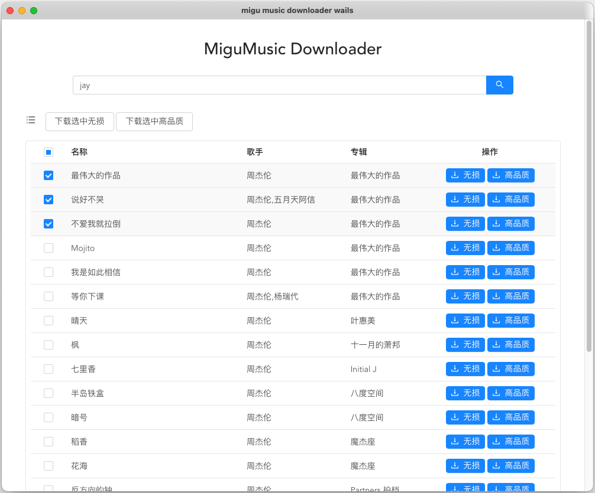

# migu_music_downloader
migu music downloader by wails.

## Installation

Download from [releases](https://github.com/lenmx/migu_music_downloader_wails/releases) 

## Debug

### Dependencies
Go 1.18+
NPM (Node 15+)

### Installing WailsWails CLI
go install github.com/wailsapp/wails/v2/cmd/wails@v2.2

### Start Debug
enter the project root directory and execute `wails dev`